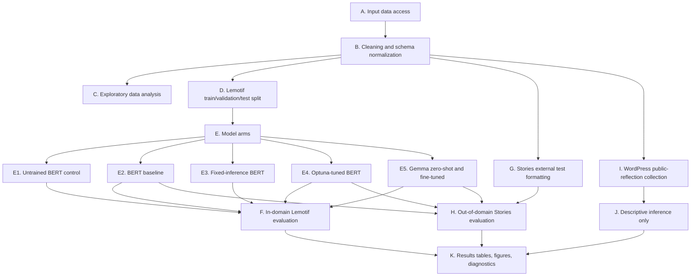

# Methodology Overview

This Methodology Overview (MO) documents the reproducible code implementation for the thesis project "How Language Models Learn to Perceive Emotions: Automating Sentiment Analysis Processes for Prediagnostic Mental Healthcare." It is written as the Code Repository Deliverable companion to the code in this repository. The purpose is to make the end-to-end machine-learning pipeline understandable and reproducible for reviewers who have access to the required source data.

Related repository documents:

- Main reproducibility entry point: [`README.md`](../README.md)
- Data access and restricted-data notes: [`data/README.md`](../data/README.md)
- Thesis reproducibility audit: [`docs/tilburg_reproducibility_audit.md`](tilburg_reproducibility_audit.md)
- WordPress descriptive-inference documentation: [`thesis_findings_vscode/wordpress_findings_codebase/README.md`](../thesis_findings_vscode/wordpress_findings_codebase/README.md)
- Results/thesis source package notes: [`docs/results_outline.tex`](results_outline.tex) and [`docs/appendix_results_figures.tex`](appendix_results_figures.tex)

## High-Level Pipeline

The thesis asks whether locally runnable language models trained on Lemotif-style emotion labels can support prediagnostic reflective mental-health tools by predicting multi-label emotions and deriving sentiment from reflective writing. The implementation separates training-domain evaluation, external human-labelled evaluation, and unlabelled descriptive inference.



## Dataset Description and Access

The project uses three data sources with distinct methodological roles.

**Lemotif training and in-domain evaluation data.** Lemotif is the main labelled source. It contains daily reflective text with an 18-emotion multi-label taxonomy and 11 topic labels. The cleaned thesis analysis file contains 1,473 reflections after preprocessing. The raw CSV is not committed to this public repository. Reviewers with approved access should place it at `data/Lemotif thesis data.csv`. The code detects the text, emotion, and topic columns in [`src/data_loader.py`](../src/data_loader.py).

**Stories external test data.** Stories is the intended prediagnostic reflection context. The full Stories study data are restricted and not published here. The thesis uses 114 manually annotated reflections mapped to the Lemotif emotion taxonomy for external evaluation. Authorized reviewers should place the workbook at `data/stories_source.xlsx`, or set `STORIES_SOURCE_XLSX_PATH` to an approved local copy. The formatting code in [`src/test_data/prepare_stories_data.py`](../src/test_data/prepare_stories_data.py) converts it into the same reflection-level schema used by Lemotif.

**WordPress public-journal corpus.** The WordPress corpus contains public reflective posts collected through a thesis-specific selected-site workflow. It is unlabelled, so it is not used for accuracy, F1, or formal bias claims. It is used only to inspect whether model outputs look plausible at scale and whether obvious descriptive distribution patterns appear. The selected public site list is included at [`thesis_findings_vscode/wordpress_findings_codebase/data/selected_sites.txt`](../thesis_findings_vscode/wordpress_findings_codebase/data/selected_sites.txt). The full scraped text tables are intentionally not bundled by default because public personal reflections can still be sensitive.

Representativeness and bias are handled by separating these roles. Lemotif is reflective but not clinical and is skewed toward common positive emotions. Stories is closer to the intended use case but small and restricted. WordPress is public and larger, but lacks human gold labels. The evaluation therefore does not claim clinical validity or automated diagnosis.

## Cleaning, Preprocessing, Transformation, and Splitting

All datasets are normalized into a reflection-level table with one text field, binary emotion columns, and where available binary topic columns.

For Lemotif, [`src/clean_data.py`](../src/clean_data.py) applies the following reproducible cleaning rules:

- remove URLs and normalize whitespace;
- remove empty or near-empty responses with 10 characters or fewer;
- remove rows with no emotion labels;
- remove duplicate reflections;
- recompute character count, word count, emotion count, and topic count;
- remove long-text outliers with 300 or more words;
- write `output/lemotif_cleaned.csv` and `output/cleaning_summary.txt`.

The BERT modelling code uses a 70/15/15 train/validation/test split with seed 42 by default. The validation split is used for threshold selection and model selection; the held-out Lemotif test split is reserved for final in-domain evaluation. The splitting implementation is in [`src/train_bert.py`](../src/train_bert.py), with environment-variable overrides for seed and split proportions. Stories is never used for main BERT training in the thesis evaluation. It is formatted separately and used as an external out-of-domain test set. WordPress is not used for training or validation.

This structure prevents leakage between the target test contexts. Lemotif supports training and in-domain testing, Stories tests transfer to the prediagnostic reflection context, and WordPress remains descriptive because it has no gold labels.

## Implemented Machine-Learning Models

The code compares six model arms or evaluation variants:

| Model arm | Purpose | Main implementation |
| --- | --- | --- |
| Untrained BERT control | Establish whether label skew/default behaviour explains performance | [`src/test_data/run_untrained_bert_comparisons.py`](../src/test_data/run_untrained_bert_comparisons.py) |
| BERT baseline | Fine-tune `bert-base-uncased` as an 18-label sigmoid classifier | [`src/train_bert.py`](../src/train_bert.py) |
| Fixed-inference BERT | Keep trained weights but change threshold/cardinality fallback to reduce overprediction | [`src/model_eda/run_threshold_cardinality_test.py`](../src/model_eda/run_threshold_cardinality_test.py) |
| Optuna BERT | Search hyperparameters such as learning rate, weight decay, warmup, batch size, sequence length, epochs, and positive-class weights | [`src/train_bert_optuna.py`](../src/train_bert_optuna.py) |
| Gemma zero-shot | Prompt a local Gemma model to select Lemotif emotions without task fine-tuning | [`src/gemma_2b_emotion_pipeline.py`](../src/gemma_2b_emotion_pipeline.py) |
| Gemma fine-tuned | Fine-tune a local Gemma adapter on the Lemotif emotion task and evaluate transfer | [`src/gemma_2b_emotion_pipeline.py`](../src/gemma_2b_emotion_pipeline.py) |

The model comparison is motivated by the deployment tradeoff in the thesis. BERT is smaller, efficient, and directly tied to the fixed emotion taxonomy. Gemma is larger and slower, but may generalize better to longer or stylistically different reflections. The fixed-inference and Optuna arms test whether threshold calibration and validation-based hyperparameter search improve a smaller local classifier.

Sentiment is derived after emotion prediction rather than trained as a separate sentiment target. The mapping is implemented in [`src/train_bert.py`](../src/train_bert.py). This keeps the pipeline interpretable: a negative, neutral, or positive summary can be traced back to predicted emotion labels.

## Evaluation Strategy and Error Analysis

The evaluation reports both fine-grained multi-label emotion performance and broader derived-sentiment performance.

Emotion metrics:

- micro F1, for aggregate performance across all label decisions;
- macro F1, to expose weakness on sparse rare labels;
- per-label F1, to identify which emotions are detected reliably;
- exact subset accuracy, the strict match between predicted and human emotion sets;
- Hamming loss, the proportion of wrong label decisions;
- predicted label cardinality, to detect overprediction or underprediction of emotion sets.

Derived-sentiment metrics:

- sentiment accuracy;
- sentiment macro F1;
- sentiment confusion matrices.

Error analysis and robustness outputs include threshold sensitivity, bootstrap confidence intervals, rare-label diagnostics, multi-label error-flow heatmaps, feature ablation, and LIME explanations. The main diagnostic implementation for the Optuna model is [`src/model_eda/run_bert_optuna_diagnostics.py`](../src/model_eda/run_bert_optuna_diagnostics.py). These diagnostics are interpreted as model-behaviour evidence, not as clinical validation.

The thesis results show that exact 18-label emotion prediction remains difficult, especially for rare and ambiguous emotions. On the Lemotif held-out set, BERT Optuna achieved the strongest emotion micro F1 reported in the thesis, while fixed-inference BERT achieved the strongest derived sentiment accuracy. On the external Stories test set, Lemotif-fine-tuned Gemma performed best among the reported external model variants for emotion micro F1 and derived sentiment accuracy. The WordPress analysis is reported descriptively only.

## Reproducibility Commands

Install dependencies:

```bash
python -m pip install -r requirements.txt
```

Run clean-environment repository checks that do not require private data, model downloads, or internet:

```bash
make check
```

Run the Lemotif cleaning and EDA pipeline after placing the approved Lemotif CSV:

```bash
python src/run_pipeline.py
```

Run the BERT baseline after placing the approved Lemotif CSV:

```bash
LEMOTIF_RUN_MODEL=1 python src/run_pipeline.py
```

Run the Optuna-tuned BERT workflow:

```bash
python src/train_bert_optuna.py
python src/model_eda/run_optuna_comparison.py
python src/model_eda/run_bert_optuna_diagnostics.py
```

Run the Stories external-test workflow after placing the restricted Stories workbook:

```bash
python src/test_data/run_all.py
```

Inspect the WordPress public-reflection workflow:

```bash
cd thesis_findings_vscode/wordpress_findings_codebase
python run_wordpress_findings.py recommended-order
python run_wordpress_findings.py smoke
```

The selected-site WordPress scrape requires internet access and local model artifacts:

```bash
python run_wordpress_findings.py selected-sites
python run_wordpress_findings.py report
python run_wordpress_findings.py thesis-tables
```

## Expected Outputs

Generated artifacts are written under `output/`, `test data/output/`, and nested `output/` folders in the thesis findings workspaces. These directories are ignored by Git because they contain generated figures, predictions, model checkpoints, or public-text scrape tables.

Key outputs include:

- `output/lemotif_cleaned.csv` and `output/cleaning_summary.txt`;
- EDA figures from `src/eda/` and `src/grouped_eda/`;
- BERT metrics, threshold scans, saved checkpoints, training history, and prediction CSVs in `output/bert_emotion_model/`;
- Optuna metrics, trial history, parameter importances, and comparison figures in `output/bert_emotion_model_optuna/`;
- Stories formatting summaries, EDA outputs, and external-evaluation metrics in `test data/output/`;
- WordPress aggregate figures and thesis tables in `thesis_findings_vscode/wordpress_findings_codebase/output/`.

Because raw data and model artifacts are not committed, reviewers should treat this repository as public reproducible code plus documentation. Full numeric replication requires authorized access to the Lemotif and Stories inputs, Hugging Face access or cached model files for large models, and compatible local compute.

## FAIR and Ethics Boundary

The repository follows a split reproducibility strategy:

- public code, commands, documentation, schema assumptions, and selected non-sensitive configuration are included;
- restricted Stories data and large model artifacts are excluded;
- generated public-reflection text tables are excluded by default even when source pages are public;
- aggregate outputs can be regenerated by authorized reviewers;
- model outputs should be used as tentative affective summaries, not diagnostic labels or automated clinical decisions.

This boundary is central to the methodology. The project tests whether emotion and sentiment summaries can support reflection, but it does not claim to infer diagnoses, risk categories, or treatment decisions.
